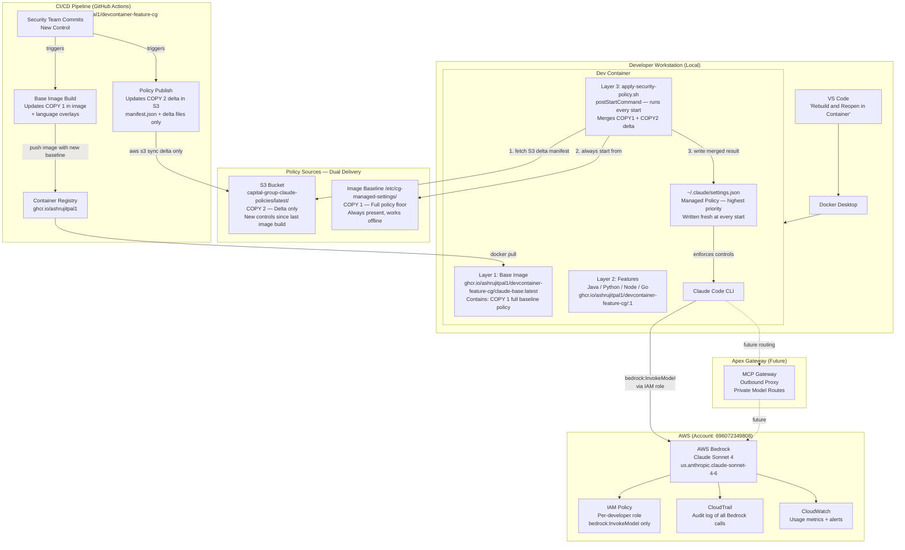
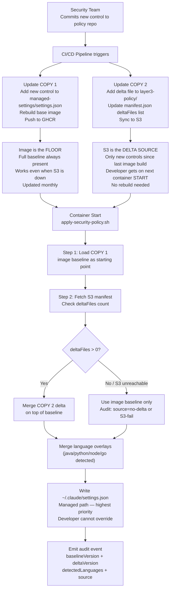
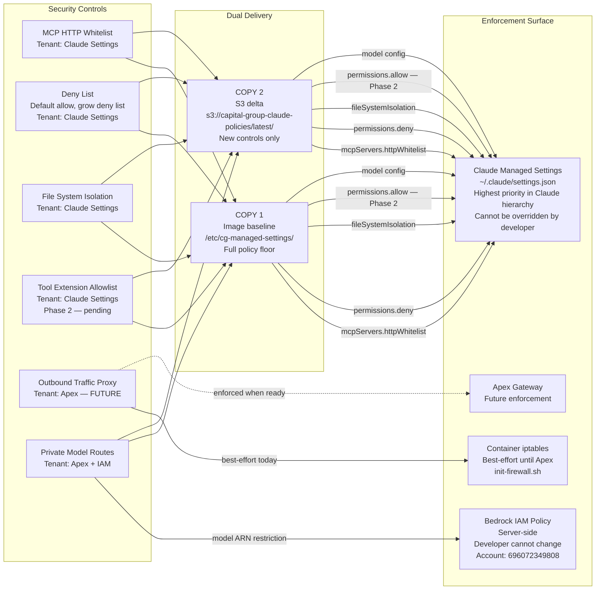
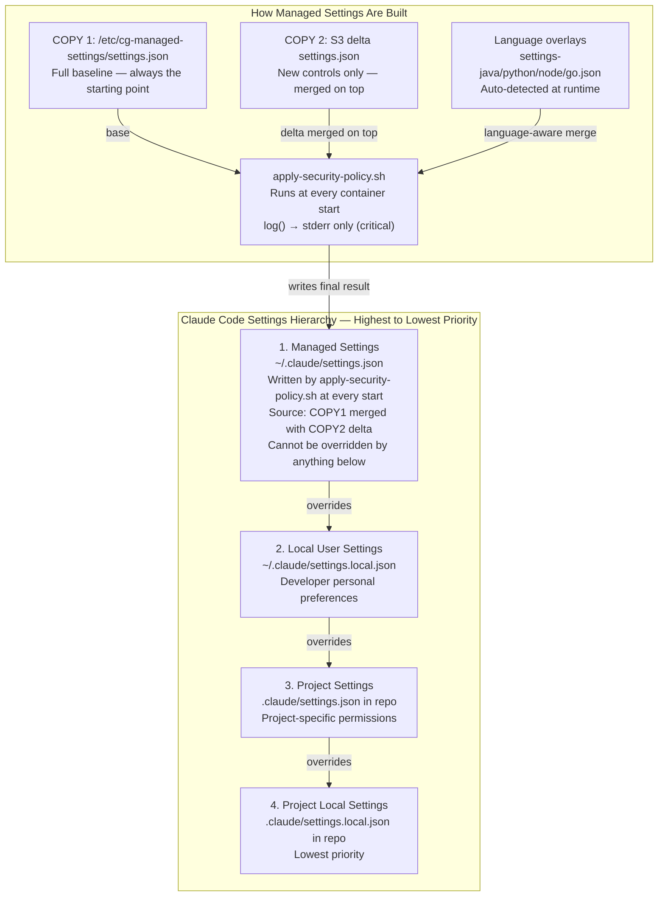
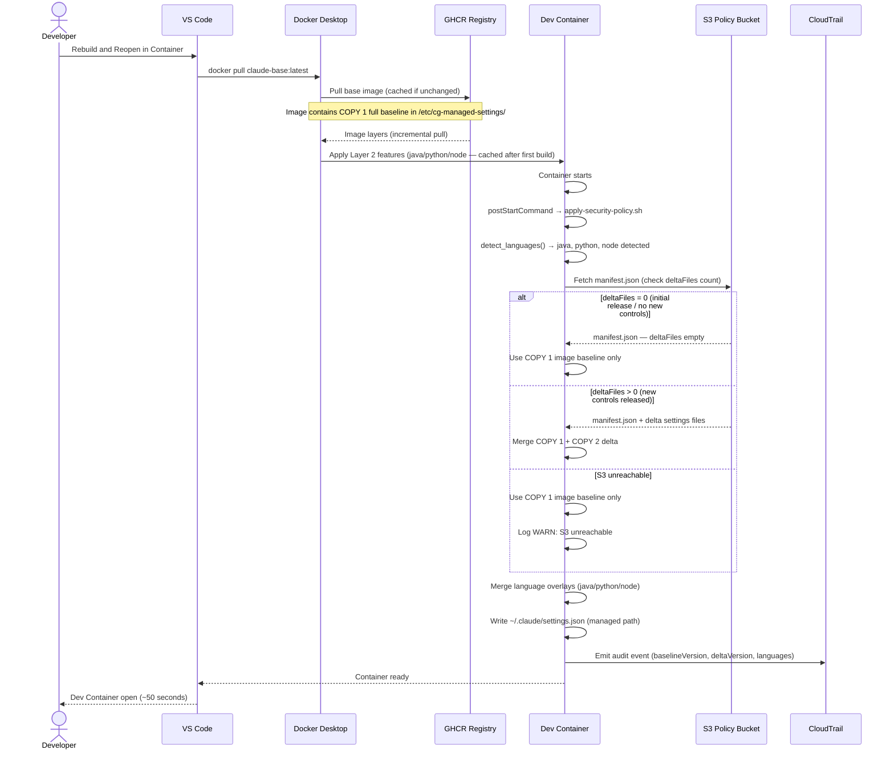
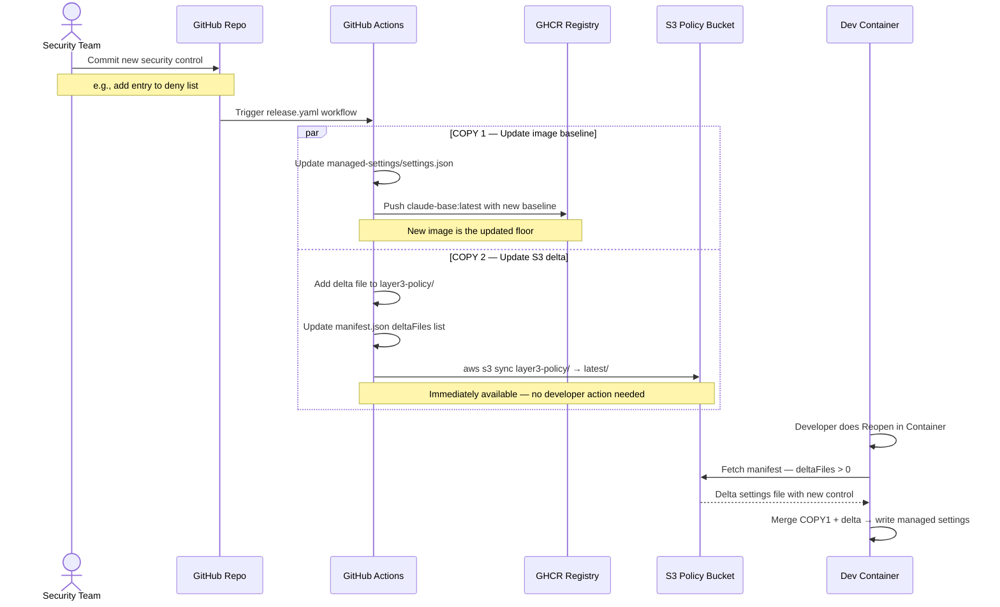
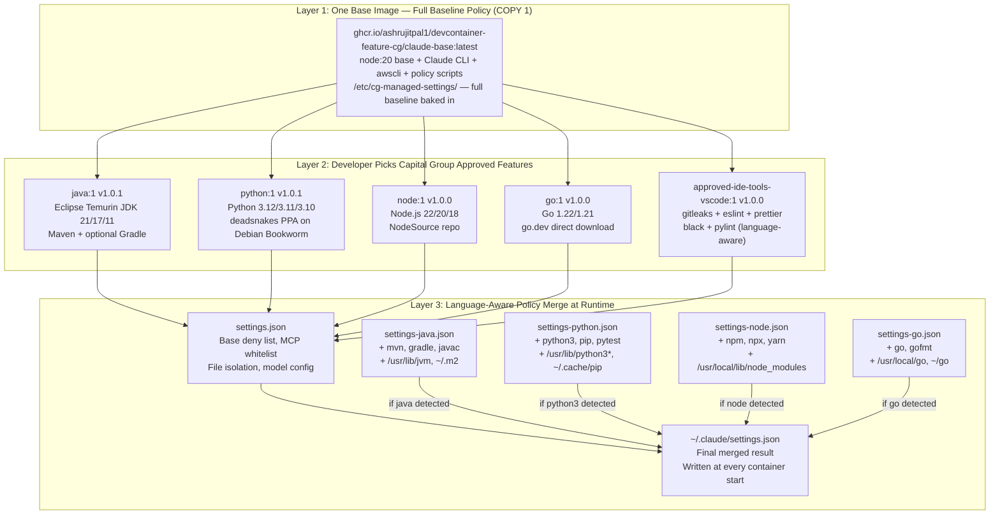
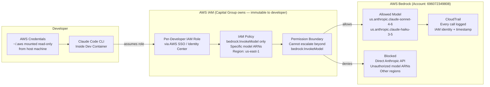
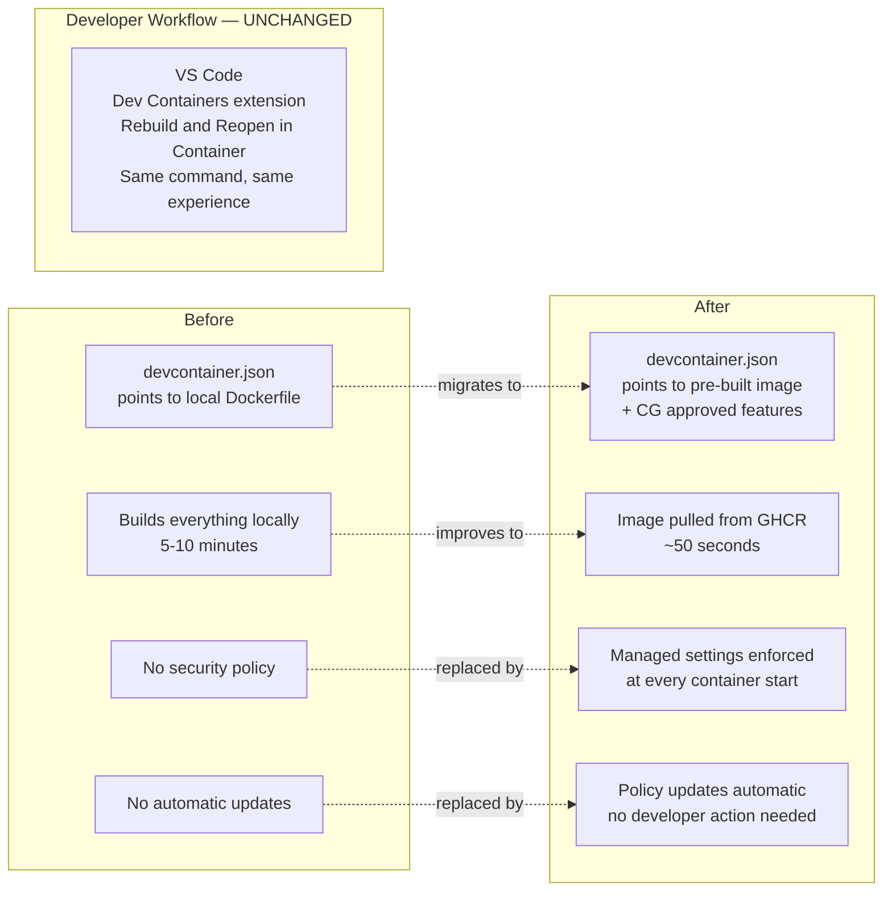
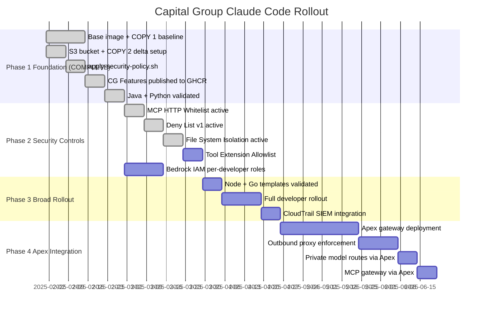

# Claude Code Dev Container Architecture — Capital Group

## Document Purpose

This document describes the architecture for rolling out Claude Code via Dev Containers
at Capital Group. It covers the 3-layer design, security control enforcement, dual-delivery
policy mechanism, multi-language support, and the developer experience.

**Implementation Status:** Phase 1 complete and validated.
**Registry:** `ghcr.io/ashrujitpal1/devcontainer-feature-cg`
**S3 Policy Bucket:** `capital-group-claude-policies`

---

## Phase 1: Architecture Overview

### Design Principles

1. Security policy is delivered by design, not by developer cooperation
2. Developer workflow (Rebuild and Reopen in Container) is never disrupted
3. Security controls are maintained in TWO places simultaneously — image baseline AND S3 delta
4. S3 holds DELTA only — new controls added since last image build (not a full copy)
5. Image holds the FULL baseline — always the policy floor, works even when S3 is unreachable
6. Security controls update without forcing image rebuilds on developers
7. Container ready time stays under 1 minute
8. Developers choose their languages freely within approved boundaries
9. Two enforcement surfaces that Capital Group owns: Claude Managed Settings + Bedrock IAM

---

### The Dual-Delivery Policy Principle

Every security control change is published to TWO places at the same time:

```
Security Team commits new control
              │
              ▼
        CI/CD Pipeline
         /           \
        /             \
       ▼               ▼
Layer 1 Image       S3 Bucket
managed-settings/   layer3-policy/
(updated baseline)  (delta only — new controls
                     since last image build)

Baked into the      Fetched at every
next image build    container start
Acts as the         Acts as the
policy FLOOR        policy DELTA SOURCE
```

**Critical distinction:**
- S3 does NOT hold a full copy of all settings — it holds only the DELTA (new controls)
- At runtime: `merged result = COPY 1 (image baseline) + COPY 2 (S3 delta)`
- At v1.0.0 initial release: S3 delta is empty (`deltaFiles: []`) — image baseline is the full policy

Why both?

- S3 alone: if S3 is unreachable, developer gets NO policy
- Image alone: developer must rebuild to get new controls — violates "upon launching" requirement
- Both together: S3 delivers freshness (delta), image delivers resilience (full baseline)

---

### The 3-Layer Model

```
┌─────────────────────────────────────────────────────────────────────┐
│ LAYER 1: Base Platform Image                                        │
│ Owner: Platform Team | Built by: CI/CD | Changes: Monthly          │
│ Registry: ghcr.io/ashrujitpal1/devcontainer-feature-cg/claude-base │
│                                                                     │
│  - node:20 base (Debian Bookworm)                                   │
│  - Core utils: git, zsh, curl, jq, awscli, iptables, fzf           │
│  - Claude Code CLI (latest)                                         │
│  - git-delta, zsh-in-docker (Powerlevel10k)                        │
│  - COPY 1: /etc/cg-managed-settings/ (policy floor, chmod 755/444) │
│    ├── manifest.json      (version metadata)                        │
│    ├── settings.json      (base policy — all developers)            │
│    ├── settings-java.json (Java overlay)                            │
│    ├── settings-python.json (Python overlay)                        │
│    ├── settings-node.json (Node overlay)                            │
│    └── settings-go.json   (Go overlay)                              │
│  - apply-security-policy.sh (baked in, runs at every start)        │
│  - init-firewall.sh (best-effort egress control until Apex)        │
│  - NO language runtimes                                             │
└─────────────────────────────────────────────────────────────────────┘
                              │
                              ▼
┌─────────────────────────────────────────────────────────────────────┐
│ LAYER 2: Language and Tooling (Dev Container Features)              │
│ Owner: Developer | Changes: When project needs change               │
│ Registry: ghcr.io/ashrujitpal1/devcontainer-feature-cg/<feature>   │
│                                                                     │
│  Developer picks from APPROVED Capital Group features:              │
│  - .../java:1        Java 21/17/11 via Eclipse Temurin + Maven      │
│  - .../python:1      Python 3.12/3.11/3.10 via deadsnakes PPA      │
│  - .../node:1        Node.js 22/20/18 via NodeSource                │
│  - .../go:1          Go 1.22/1.21 via go.dev                       │
│  - .../approved-ide-tools-vscode:1  Linters, formatters, gitleaks  │
│                                                                     │
│  Cached in Docker layer after first build — no rebuild cost         │
└─────────────────────────────────────────────────────────────────────┘
                              │
                              ▼
┌─────────────────────────────────────────────────────────────────────┐
│ LAYER 3: Security Policy (postStartCommand)                         │
│ Owner: Security Team | Changes: Biweekly/Monthly | Rebuild: NEVER  │
│ Source: s3://capital-group-claude-policies/latest/                  │
│                                                                     │
│  Runs at EVERY container start via apply-security-policy.sh:        │
│  1. Detect installed language runtimes (java, python, node, go)     │
│  2. Fetch S3 delta manifest — check deltaFiles count                │
│     - deltaFiles = 0 → use image baseline only (COPY 1)            │
│     - deltaFiles > 0 → merge delta on top of baseline              │
│  3. Merge COPY 1 + COPY 2 delta + language-specific overlays       │
│  4. Write to ~/.claude/settings.json (Claude managed path)          │
│     → Highest priority — cannot be overridden by developer          │
│  5. Emit audit event (policy version, source, languages detected)   │
│                                                                     │
│  Key implementation note: log() writes to STDERR only to prevent   │
│  log lines from polluting JSON captured by $() substitution         │
└─────────────────────────────────────────────────────────────────────┘
```

---

## Phase 2: System Context Diagram



---

## Phase 3: Dual-Delivery Policy Mechanism (Core Design)



---

## Phase 4: Security Control Enforcement Map



---

## Phase 5: Claude Settings Hierarchy



---

## Phase 6: Container Startup Sequence



---

## Phase 7: Policy Update Flow (Biweekly/Monthly)



---

## Phase 8: Multi-Language Architecture



---

## Phase 9: Bedrock IAM Enforcement



---

## Phase 10: Developer Experience



---

## Phase 11: Rollout Gantt



---

## Summary Tables

### Published Assets (Current State)

| Asset | Registry / Location | Version | Status |
|---|---|---|---|
| Base Image | `ghcr.io/ashrujitpal1/devcontainer-feature-cg/claude-base:latest` | latest | ✅ Live |
| Java Feature | `ghcr.io/ashrujitpal1/devcontainer-feature-cg/java:1` | 1.0.1 | ✅ Live |
| Python Feature | `ghcr.io/ashrujitpal1/devcontainer-feature-cg/python:1` | 1.0.1 | ✅ Live |
| Node Feature | `ghcr.io/ashrujitpal1/devcontainer-feature-cg/node:1` | 1.0.0 | ✅ Live |
| Go Feature | `ghcr.io/ashrujitpal1/devcontainer-feature-cg/go:1` | 1.0.0 | ✅ Live |
| Approved IDE Tools | `ghcr.io/ashrujitpal1/devcontainer-feature-cg/approved-ide-tools-vscode:1` | 1.0.0 | ✅ Live |
| S3 Policy Bucket | `s3://capital-group-claude-policies/latest/` | v1.0.0 | ✅ Live |

### Enforcement Model

| Security Control | Enforcement Surface | Delivery | Status |
|---|---|---|---|
| MCP HTTP Whitelist | Claude Managed Settings | COPY 1 (image) | ✅ Active Phase 1 |
| Deny List | Claude Managed Settings | COPY 1 (image) | ✅ Active Phase 1 |
| File System Isolation | Claude Managed Settings | COPY 1 (image) | ✅ Active Phase 1 |
| Tool Extension Allowlist | Claude Managed Settings | COPY 1 + COPY 2 | ⏳ Phase 2 |
| Outbound Traffic Proxy | Apex Gateway | Apex | ⏳ Phase 4 |
| Private Model Routes | Bedrock IAM | IAM Policy | ✅ Active Phase 1 |

### Policy Source Behaviour

| Scenario | Source Used | Result | Audit Log |
|---|---|---|---|
| Normal, no new controls | COPY 1 image baseline | Floor policy | `deltaSource=no-delta` |
| New controls released | COPY 1 + COPY 2 delta | Latest policy | `deltaSource=s3` |
| S3 unreachable | COPY 1 image baseline | Floor policy | `deltaSource=no-delta, WARN` |

### Layer Rebuild Trigger

| Layer | Trigger | Who | Developer Impact |
|---|---|---|---|
| Layer 1 Base Image | Claude CLI bump, OS patch, new tool | Platform team CI/CD | docker pull on next Rebuild |
| Layer 2 Features | Developer adds/removes language | Developer | One-time install, cached after |
| Layer 3 Security Policy | Biweekly/monthly control change | Security team CI/CD | Zero rebuild — applied at start |

---

## Key Implementation Notes (Lessons Learned)

1. **log() must write to stderr** — `log()` redirects to `>&2` so log lines never pollute stdout captured by `$()` command substitution in `merge_settings()` and `fetch_delta_policy()`

2. **Directory permissions** — `/etc/cg-managed-settings/` must be `755` (traversable), files `444` (read-only). `chmod -R 444` incorrectly makes the directory untraversable.

3. **Java on Debian Bookworm** — `openjdk-21-jdk` is not in default Bookworm apt repo. Use Eclipse Temurin via Adoptium API instead.

4. **Python on Debian Bookworm** — `python3.12` requires deadsnakes PPA. Default Bookworm ships Python 3.11.

5. **S3 holds delta only** — S3 is NOT a full copy of the image settings. It holds only new controls added since the last image build. The merge is always `COPY1 + COPY2 delta`.

6. **GHCR namespace** — Features publish to `ghcr.io/<github-username>/<repo-name>/<feature-id>`, not `ghcr.io/<org>/features/<feature-id>`.
