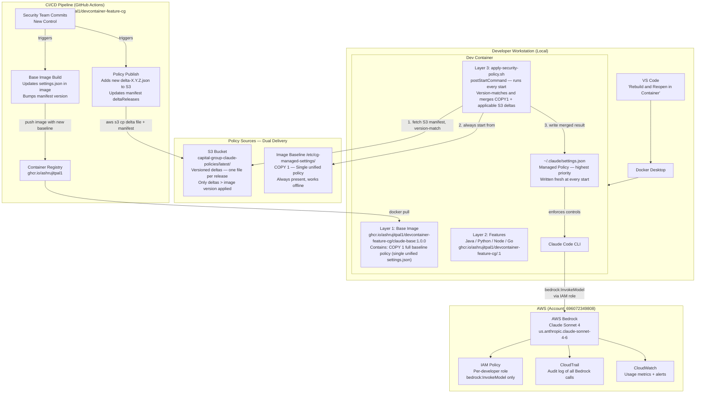
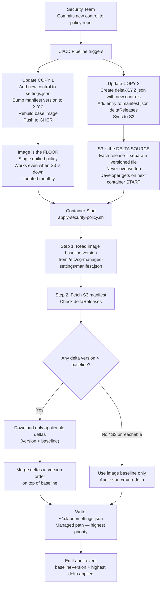
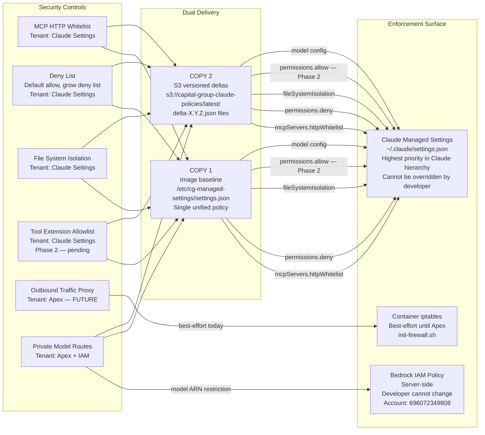
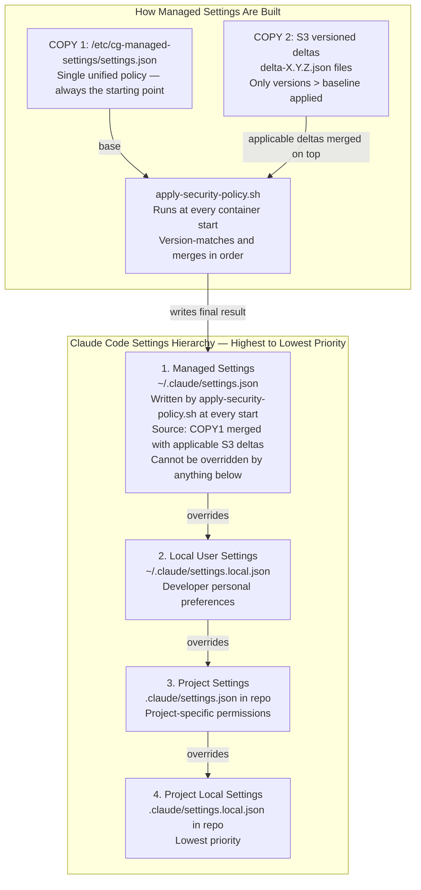
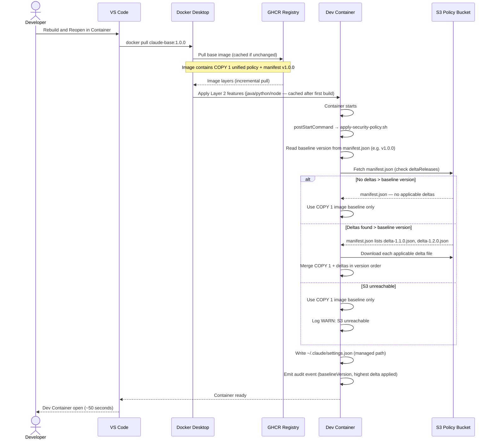
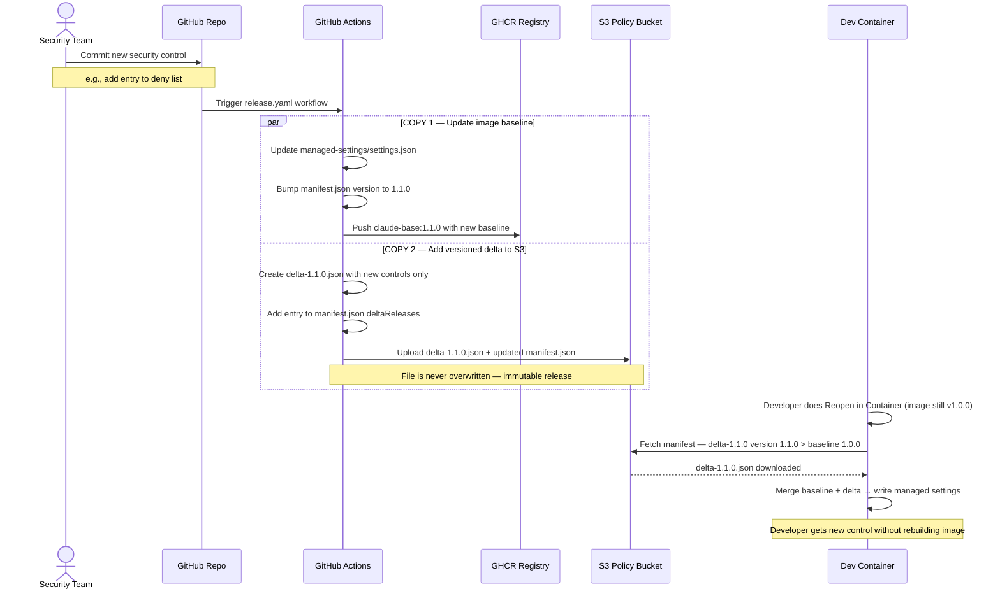
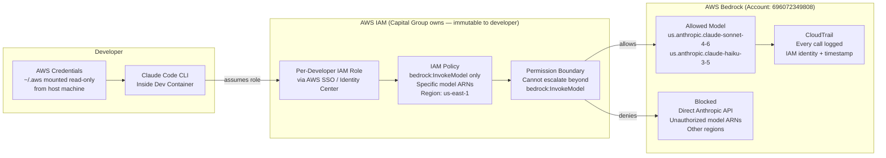

# Claude Code Dev Container Architecture — Capital Group

## Document Purpose

This document describes the architecture for rolling out Claude Code via Dev Containers
at Capital Group. It covers the 3-layer design, security control enforcement, dual-delivery
policy mechanism, and the developer experience.

**Implementation Status:** Phase 1 complete and validated.
**Registry:** `ghcr.io/ashrujitpal1/devcontainer-feature-cg`
**S3 Policy Bucket:** `capital-group-claude-policies`

---

## Phase 1: Architecture Overview

### Design Principles

1. Security policy is delivered by design, not by developer cooperation
2. Developer workflow (Rebuild and Reopen in Container) is never disrupted
3. Security controls are maintained in TWO places simultaneously — image baseline AND S3 versioned deltas
4. S3 holds VERSIONED DELTAS only — each release is a separate file, never overwritten
5. Image holds the FULL baseline — always the policy floor, works even when S3 is unreachable
6. Version matching ensures only deltas newer than the image baseline are applied
7. Container ready time stays under 1 minute
8. Developers choose their languages freely within approved boundaries
9. Single unified policy — no language-specific settings files
10. Two enforcement surfaces that Capital Group owns: Claude Managed Settings + Bedrock IAM

---

### The Dual-Delivery Policy Principle

Every security control change is published to TWO places at the same time:

```
Security Team commits new control
              │
              ▼
        CI/CD Pipeline
         /           \
        /             \
       ▼               ▼
Layer 1 Image       S3 Bucket
managed-settings/   layer3-policy/
settings.json       delta-X.Y.Z.json (versioned, never overwritten)
(updated baseline)

Baked into the      Fetched at every
next image build    container start
Acts as the         Acts as the
policy FLOOR        policy DELTA SOURCE
```

**Critical distinctions:**
- S3 does NOT hold a full copy — it holds only VERSIONED DELTAS (one file per release)
- Each delta file is named `delta-X.Y.Z.json` and is never overwritten
- At runtime: `merged result = COPY 1 (image baseline) + applicable S3 deltas (version > baseline)`
- Version matching: script reads image baseline version from manifest.json, fetches only deltas with higher version
- At v1.0.0 initial release: S3 deltaReleases is empty — image baseline is the full policy
- Single unified policy — all language permissions are in one `settings.json`

Why both?

- S3 alone: if S3 is unreachable, developer gets NO policy
- Image alone: developer must rebuild to get new controls — violates "upon launching" requirement
- Both together: S3 delivers freshness (versioned deltas), image delivers resilience (full baseline)

---

### The 3-Layer Model

```
┌─────────────────────────────────────────────────────────────────────┐
│ LAYER 1: Base Platform Image                                        │
│ Owner: Platform Team | Built by: CI/CD | Changes: Monthly          │
│ Registry: ghcr.io/ashrujitpal1/devcontainer-feature-cg/claude-base │
│                                                                     │
│  - node:20 base (Debian Bookworm)                                   │
│  - Core utils: git, zsh, curl, jq, awscli, iptables, fzf           │
│  - Claude Code CLI (latest)                                         │
│  - git-delta, zsh-in-docker (Powerlevel10k)                        │
│  - COPY 1: /etc/cg-managed-settings/ (policy floor, chmod 755/444) │
│    ├── manifest.json      (version metadata — used for matching)    │
│    └── settings.json      (single unified policy — all languages)   │
│  - apply-security-policy.sh (baked in, runs at every start)        │
│  - init-firewall.sh (best-effort egress control until Apex)        │
│  - NO language runtimes                                             │
└─────────────────────────────────────────────────────────────────────┘
                              │
                              ▼
┌─────────────────────────────────────────────────────────────────────┐
│ LAYER 2: Language and Tooling (Dev Container Features)              │
│ Owner: Developer | Changes: When project needs change               │
│ Registry: ghcr.io/ashrujitpal1/devcontainer-feature-cg/<feature>   │
│                                                                     │
│  Developer picks from APPROVED Capital Group features:              │
│  - .../java:1        Java 21/17/11 via Eclipse Temurin + Maven      │
│  - .../python:1      Python 3.12/3.11/3.10 via deadsnakes PPA      │
│  - .../node:1        Node.js 22/20/18 via NodeSource                │
│  - .../go:1          Go 1.22/1.21 via go.dev                       │
│  - .../approved-ide-tools-vscode:1  Linters, formatters, gitleaks  │
│                                                                     │
│  Cached in Docker layer after first build — no rebuild cost         │
└─────────────────────────────────────────────────────────────────────┘
                              │
                              ▼
┌─────────────────────────────────────────────────────────────────────┐
│ LAYER 3: Security Policy (postStartCommand)                         │
│ Owner: Security Team | Changes: Biweekly/Monthly | Rebuild: NEVER  │
│ Source: s3://capital-group-claude-policies/latest/                  │
│                                                                     │
│  Runs at EVERY container start via apply-security-policy.sh:        │
│  1. Read image baseline version from manifest.json                  │
│  2. Fetch S3 delta manifest — check deltaReleases                   │
│  3. Version match: download only deltas with version > baseline     │
│  4. Merge COPY 1 + applicable deltas (in version order)             │
│  5. Write to ~/.claude/settings.json (Claude managed path)          │
│     → Highest priority — cannot be overridden by developer          │
│  6. Emit audit event (baseline version, delta versions applied)     │
│                                                                     │
│  Key: each delta is a separate file (delta-X.Y.Z.json), never      │
│  overwritten. If developer hasn't rebuilt, ALL missed deltas are    │
│  applied in order.                                                  │
└─────────────────────────────────────────────────────────────────────┘
```

---

## Phase 2: System Context Diagram



---

## Phase 3: Versioned Delta Policy Mechanism (Core Design)



### Example: Version Matching in Action

```
Image baseline version: 1.0.0

S3 manifest deltaReleases:
  - delta-1.1.0.json  (version: 1.1.0)  → 1.1.0 > 1.0.0 ✅ APPLY
  - delta-1.2.0.json  (version: 1.2.0)  → 1.2.0 > 1.0.0 ✅ APPLY
  - delta-1.3.0.json  (version: 1.3.0)  → 1.3.0 > 1.0.0 ✅ APPLY

Developer rebuilds image → new baseline version: 1.3.0

Next container start:
  - delta-1.1.0.json  (version: 1.1.0)  → 1.1.0 > 1.3.0 ❌ SKIP (already in baseline)
  - delta-1.2.0.json  (version: 1.2.0)  → 1.2.0 > 1.3.0 ❌ SKIP (already in baseline)
  - delta-1.3.0.json  (version: 1.3.0)  → 1.3.0 > 1.3.0 ❌ SKIP (already in baseline)

Security team releases 1.4.0:
  - delta-1.4.0.json  (version: 1.4.0)  → 1.4.0 > 1.3.0 ✅ APPLY
```

---

## Phase 4: Security Control Enforcement Map



---

## Phase 5: Claude Settings Hierarchy



---

## Phase 6: Container Startup Sequence



---

## Phase 7: Policy Update Flow (Biweekly/Monthly)



---

## Phase 8: Bedrock IAM Enforcement



---

## Summary Tables

### Published Assets (Current State)

| Asset | Registry / Location | Version | Status |
|---|---|---|---|
| Base Image | `ghcr.io/ashrujitpal1/devcontainer-feature-cg/claude-base:1.0.0` | 1.0.0 | ✅ Live |
| Java Feature | `ghcr.io/ashrujitpal1/devcontainer-feature-cg/java:1` | 1.0.1 | ✅ Live |
| Python Feature | `ghcr.io/ashrujitpal1/devcontainer-feature-cg/python:1` | 1.0.1 | ✅ Live |
| Node Feature | `ghcr.io/ashrujitpal1/devcontainer-feature-cg/node:1` | 1.0.0 | ✅ Live |
| Go Feature | `ghcr.io/ashrujitpal1/devcontainer-feature-cg/go:1` | 1.0.0 | ✅ Live |
| Approved IDE Tools | `ghcr.io/ashrujitpal1/devcontainer-feature-cg/approved-ide-tools-vscode:1` | 1.0.0 | ✅ Live |
| S3 Policy Bucket | `s3://capital-group-claude-policies/latest/` | v1.0.0 | ✅ Live |

### Enforcement Model

| Security Control | Enforcement Surface | Delivery | Status |
|---|---|---|---|
| MCP HTTP Whitelist | Claude Managed Settings | COPY 1 (image) | ✅ Active Phase 1 |
| Deny List | Claude Managed Settings | COPY 1 (image) | ✅ Active Phase 1 |
| File System Isolation | Claude Managed Settings | COPY 1 (image) | ✅ Active Phase 1 |
| Tool Extension Allowlist | Claude Managed Settings | COPY 1 + COPY 2 | ⏳ Phase 2 |
| Outbound Traffic Proxy | Apex Gateway | Apex | ⏳ Phase 4 |
| Private Model Routes | Bedrock IAM | IAM Policy | ✅ Active Phase 1 |

### Policy Source Behaviour

| Scenario | Source Used | Result | Audit Log |
|---|---|---|---|
| Normal, no new controls | COPY 1 image baseline | Floor policy | `deltaSource=no-delta` |
| New controls released, dev hasn't rebuilt | COPY 1 + all deltas > baseline | Latest policy | `deltaSource=s3` |
| Dev rebuilt image (latest baseline) | COPY 1 only (no applicable deltas) | Latest policy | `deltaSource=no-delta` |
| S3 unreachable | COPY 1 image baseline | Floor policy | `deltaSource=no-delta, WARN` |

### Layer Rebuild Trigger

| Layer | Trigger | Who | Developer Impact |
|---|---|---|---|
| Layer 1 Base Image | Claude CLI bump, OS patch, new tool | Platform team CI/CD | docker pull on next Rebuild |
| Layer 2 Features | Developer adds/removes language | Developer | One-time install, cached after |
| Layer 3 Security Policy | Biweekly/monthly control change | Security team CI/CD | Zero rebuild — applied at start |

---

## Key Implementation Notes

1. **log() must write to stderr** — `log()` redirects to `>&2` so log lines never pollute stdout captured by `$()` command substitution.

2. **Directory permissions** — `/etc/cg-managed-settings/` must be `755` (traversable), files `444` (read-only).

3. **Single unified policy** — All language permissions (java, python, node, go) are in one `settings.json`. Security team maintains one file only.

4. **Versioned deltas** — Each S3 delta is a separate file (`delta-X.Y.Z.json`), never overwritten. The manifest tracks all releases in `deltaReleases` array.

5. **Version matching** — Script reads baseline version from image manifest, compares against each delta's version using semver, and only applies deltas with version strictly greater than baseline.

6. **Missed updates are caught** — If a developer hasn't rebuilt their image for 3 releases (1.1.0, 1.2.0, 1.3.0), all three deltas are downloaded and merged in order on next container start.

7. **S3 holds delta only** — S3 is NOT a full copy of the image settings. It holds only new controls added since the last image build.
